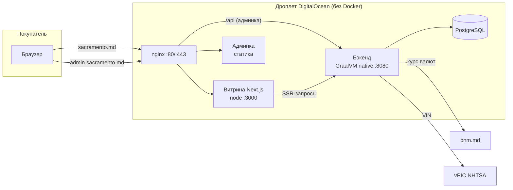
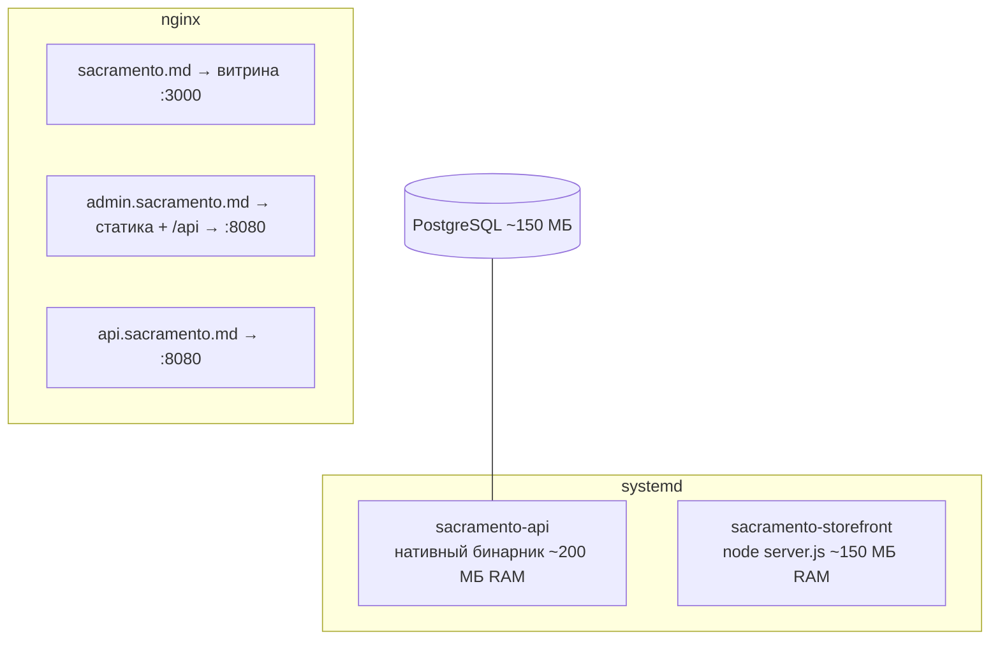
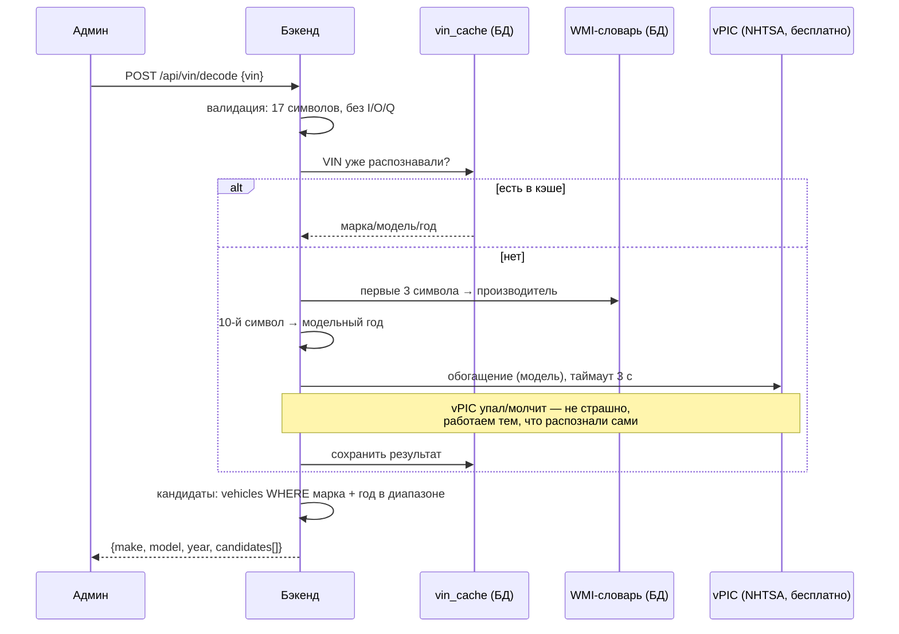
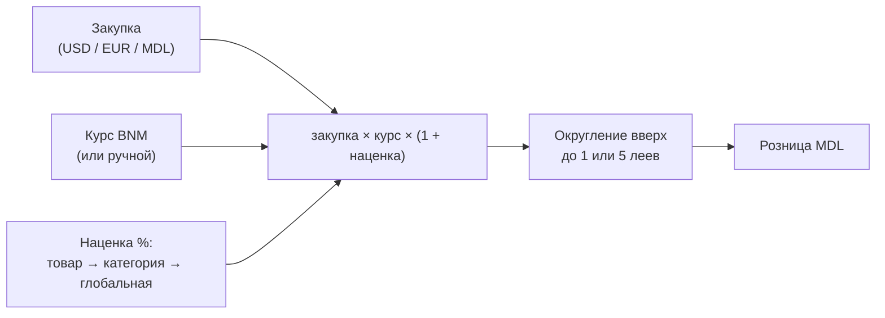
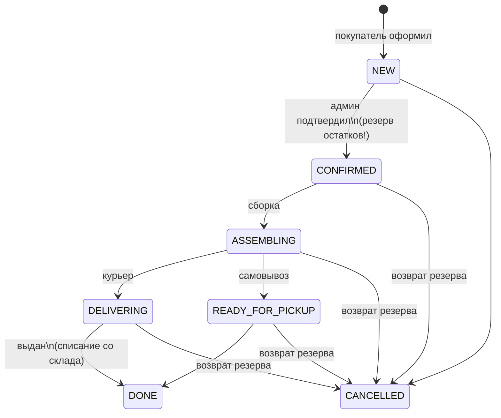

# Sacramento — как всё устроено и как этим пользоваться

Интернет-магазин автозапчастей: витрина + админ-панель + API.
Молдова, цены в леях (MDL) по курсу Национального банка (BNM).

---

## 1. Из чего состоит проект

```
autoparts/
├── backend/               Java 25 · Spring Boot 4 · PostgreSQL 17 · Flyway
├── frontend/
│   ├── storefront/        Витрина · Next.js + MUI · SSR (для SEO)
│   └── admin/             Админка · Vite + React + MUI · SPA
├── scripts/
│   ├── start-local.sh     запустить всё локально (Docker только для PostgreSQL)
│   ├── stop-local.sh      остановить всё локальное
│   ├── build-release.sh   собрать релиз для сервера (GraalVM native, без Docker на сервере)
│   └── deploy/install.sh  установщик, который запускается на дроплете
└── docs/                  спецификация, планы, это руководство
```

### Общая архитектура



Бэкенд — модульный монолит, модули по пакетам: `catalog` (товары/категории),
`vehicles` + `vin` (автомобили и VIN), `pricing` (курс и цены), `orders` (заказы),
`media` (фото в БД), `importexport` (снэпшоты и импорт), `auth` (вход админа).

---

## 2. Запуск локально (разработка)

Нужны: Docker (только для PostgreSQL), Java 25, Node 20+.

```bash
./scripts/start-local.sh
```

| Что | Адрес |
|---|---|
| Витрина | http://localhost:3030 |
| Админка | http://localhost:5180 (admin / sacramento2026) |
| API | http://localhost:8090 |
| PostgreSQL | localhost:5544 (sacramento / sacramento) |

Логи: `tail -f .local/logs/*.log` · Остановка: `./scripts/stop-local.sh`
Тесты бэкенда: `cd backend && mvn test` (Testcontainers, нужен Docker).

---

## 3. Деплой на дроплет (продакшен, без Docker)

Как договорились: на сервере никакого Docker — бэкенд компилируется
в **нативный бинарник GraalVM** и работает под systemd. Docker нужен только
**локально при сборке**: ваш Mac не может собрать Linux-бинарник напрямую,
поэтому сборка идёт внутри GraalVM-контейнера под linux/amd64.

### Шаг 1 — собрать релиз (на вашем Mac)

```bash
./scripts/build-release.sh          # native (15–40 мин, Docker'у нужно ≥8 ГБ RAM)
# или быстрый фолбэк, если native капризничает:
./scripts/build-release.sh jar
```

Получится `release/sacramento-release.tar.gz` — внутри нативный бинарник бэкенда,
статика админки, standalone-витрина и установщик.

### Шаг 2 — закинуть на дроплет и установить

```bash
scp release/sacramento-release.tar.gz root@ВАШ_IP:/root/
ssh root@ВАШ_IP
tar xzf sacramento-release.tar.gz && cd sacramento
./install.sh sacramento.md          # ваш домен
```

Установщик сам: создаст swap, поставит PostgreSQL/nginx/Node, заведёт базу
со случайным паролем, разложит файлы в `/opt/sacramento`, создаст systemd-сервисы
`sacramento-api` и `sacramento-storefront`, настроит nginx на три поддомена
и ежедневный бэкап БД. **Обновление = собрать новый релиз и снова `./install.sh`.**

### Шаг 3 — DNS и HTTPS

В панели регистратора — четыре A-записи на IP дроплета: `@`, `www`, `admin`, `api`.
Затем на сервере:

```bash
certbot --nginx -d sacramento.md -d www.sacramento.md -d admin.sacramento.md -d api.sacramento.md
```

### Раскладка на сервере



Бюджет памяти на дроплете $6 (1 ГБ): всё вместе ~500–600 МБ + swap 2 ГБ как страховка.

---

## 4. Один домен на всё — да, так и задумано

Покупаете **один** домен `sacramento.md`. Поддомены бесплатны и создаются
обычными DNS-записями:

| Адрес | Что открывается |
|---|---|
| `sacramento.md` (+ `www`) | витрина для покупателей |
| `admin.sacramento.md` | админ-панель |
| `api.sacramento.md` | чистое API (пригодится, если витрину перенесёте на Vercel) |

Сертификаты на все поддомены выпускает бесплатный Let's Encrypt одной командой.
Админка ходит к API через свой же домен (`admin.sacramento.md/api/...`),
поэтому cookie-сессия работает без танцев с CORS.

---

## 5. Как работает VIN-поиск (для админа)

VIN сам по себе **не содержит списка запчастей** — он идентифицирует автомобиль.
Поэтому распознавание двухступенчатое: `VIN → автомобиль → товары из применимости`.
На витрине VIN-поля нет (убрали на этапе дизайна — там ручной подбор
«марка → модель → год»), а в админке VIN-поиск живёт на экране **«Применимость»**:
админ вводит VIN клиента и видит марку/год + подходящие автомобили из справочника.



Три уровня распознавания (все бесплатные):

1. **Локальный декодер** — таблица `wmi_codes` (~120 производителей) даёт марку
   по первым 3 символам VIN; 10-й символ — модельный год. Ноль внешних запросов.
2. **NHTSA vPIC** — государственный API США, без ключа и лимитов. Для европейских
   VIN часто добавляет модель. Fail-open: если недоступен — просто пропускается.
3. **Справочник применимости** — наша таблица `vehicles` + связка
   `product_vehicles`. Кандидаты — автомобили той же марки с пересечением по году.

Результаты кэшируются (`vin_cache`), на эндпоинте rate-limit 10 запросов/мин с IP.
Если бизнес дорастёт до платного декодера (Laximo) — он подключается как ещё один
адаптер, не трогая остальное.

---

## 6. Как считаются цены



- Планировщик трижды в день (07:00/10:00/13:00) тянет курс USD/EUR с bnm.md.
- Смена курса/наценки/округления → автоматический пересчёт всех цен,
  у которых не стоит галочка «ручная цена».
- Оптовая цена — отдельное поле, видна только в админке; применяется
  переключателем «розница/опт» в карточке заказа.

---

## 7. Жизненный цикл заказа



Ключевое: **остаток резервируется только при подтверждении админом** (не при
оформлении на сайте). Цены фиксируются в заказе на момент оформления — последующие
изменения курса заказ не трогают. Оплата офлайн: наличные курьеру, либо
карта/наличные на точке самовывоза — способ просто фиксируется в заказе.

---

## 8. Снэпшоты и импорт

- **Каждый день в 23:55** бэкенд выгружает весь каталог (артикулы, цены, остатки,
  полки, применимость) в CSV + XLSX и хранит последние 30 снэпшотов —
  скачиваются в админке («Импорт/экспорт»).
- **Импорт обратно**: загрузка файла → предпросмотр «Создаётся N · Обновляется M ·
  Ошибки K (с номерами строк)» → подтверждение → upsert по артикулу.
- **Разовый импорт учётного .xls** (ваш файл «наличие») — отдельная кнопка там же:
  парсер вытаскивает применимость из названий («Audi A4 8/97>01…»), полки «43*19»
  и помечает распознанное как «авто», чтобы вы могли проверить.
- Плюс на сервере ежедневный `pg_dump` в `/var/backups/sacramento` (14 дней).

---

## 9. Шпаргалка

| Действие | Команда |
|---|---|
| Запустить всё локально | `./scripts/start-local.sh` |
| Остановить локальное | `./scripts/stop-local.sh` |
| Тесты бэкенда | `cd backend && mvn test` |
| Собрать релиз для сервера | `./scripts/build-release.sh` (или `jar`) |
| Установить/обновить на сервере | `./install.sh sacramento.md` (из распакованного релиза) |
| Логи на сервере | `journalctl -u sacramento-api -f` |
| Бэкап БД руками | `sudo -u postgres pg_dump sacramento \| gzip > backup.sql.gz` |

Пароль админа по умолчанию `admin / sacramento2026` — **сменить при первом входе**
(Настройки → смена пароля).
